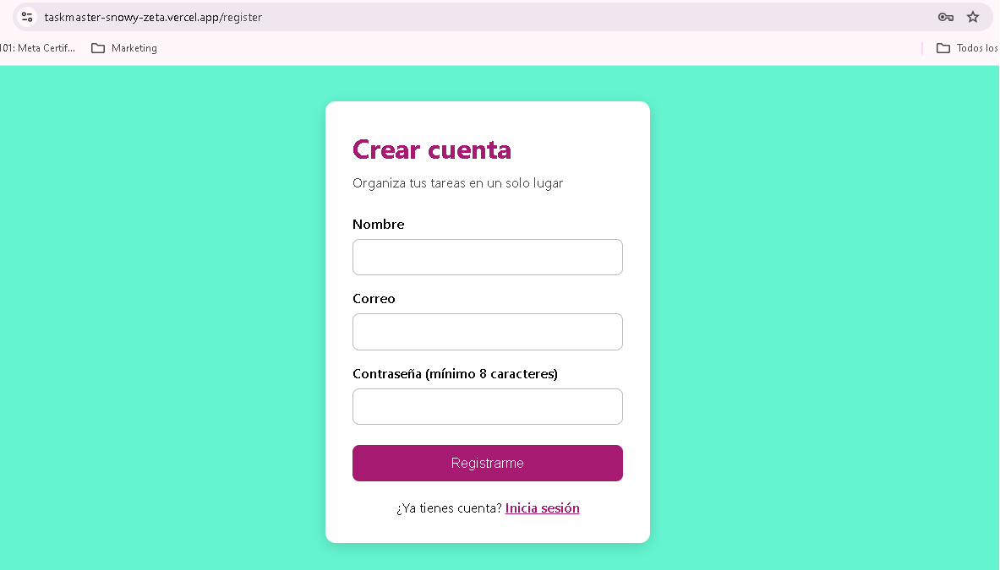
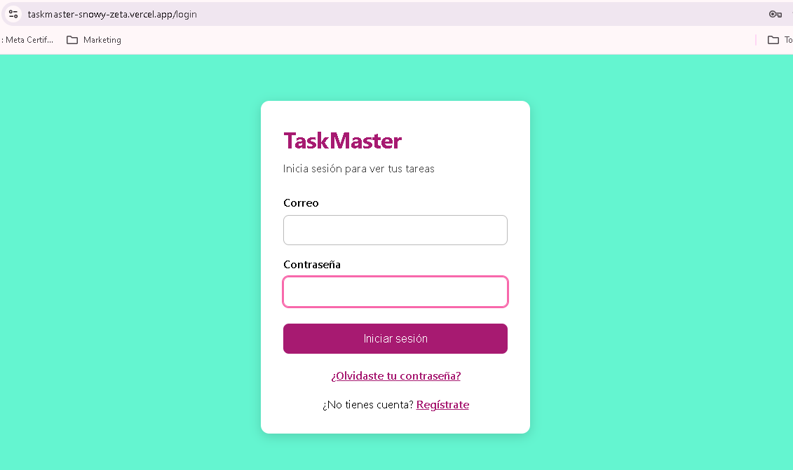
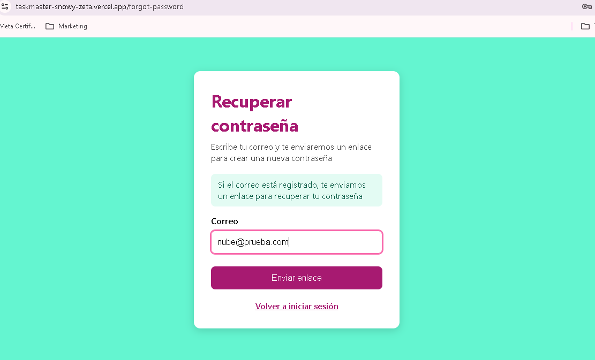
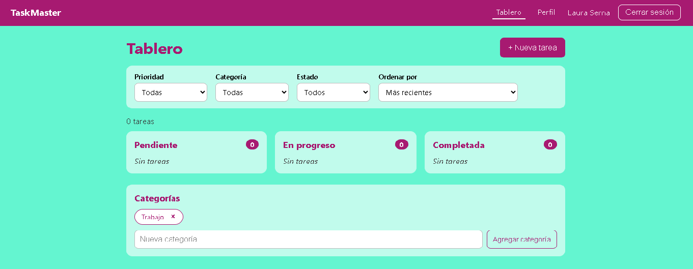

# Manual de usuario de TaskMaster

TaskMaster te permite organizar tus tareas en un tablero con tres columnas: **Pendiente**, **En progreso** y **Completada**.

**Dirección de la aplicación:** https://taskmaster-snowy-zeta.vercel.app

> **Aviso:** la primera vez que abres la aplicación después de un rato sin usarla, puede tardar cerca de un minuto en responder. Es normal: espera sin recargar la página.

## 1. Crear una cuenta

1. Abre la aplicación. Si no has iniciado sesión, verás la pantalla **Iniciar sesión**.
2. Haz clic en **Regístrate**.
3. Escribe tu nombre, tu correo y una contraseña de al menos 8 caracteres.
4. Presiona **Registrarme**. Entrarás directamente a tu tablero.

Si el correo ya está registrado, la aplicación te lo indicará.

## 2. Iniciar y cerrar sesión

1. En **Iniciar sesión**, escribe tu correo y tu contraseña, y presiona **Iniciar sesión**.
2. Tu sesión se mantiene aunque recargues la página.
3. Para salir, presiona **Cerrar sesión** en la barra superior.

## 3. Recuperar tu contraseña

1. En **Iniciar sesión**, haz clic en **¿Olvidaste tu contraseña?**.
2. Escribe tu correo y presiona **Enviar enlace**. Verás un mensaje de confirmación.
3. Abre el correo que recibirás y haz clic en **Crear nueva contraseña**. El enlace dura **una hora** y solo se puede usar **una vez**.
4. Escribe la nueva contraseña dos veces y presiona **Cambiar contraseña**.
5. Inicia sesión con la contraseña nueva.

> **Nota para la demostración:** en esta versión de prueba, los correos llegan a un buzón de pruebas (Mailtrap) y no a una bandeja real. El enlace se abre desde ese buzón.

Por seguridad, la aplicación muestra el mismo mensaje exista o no el correo.

## 4. El tablero

Al iniciar sesión verás tu tablero con tres columnas. Arriba de cada columna aparece cuántas tareas contiene.

### Crear una tarea

1. Presiona **+ Nueva tarea**.
2. Llena el formulario:
   - **Título** (obligatorio).
   - **Descripción** (opcional).
   - **Fecha de vencimiento** (opcional).
   - **Prioridad:** baja, media o alta.
   - **Estado:** en qué columna empieza.
   - **Categoría:** una de las tuyas, o ninguna.
3. Presiona **Crear tarea**.

### Mover una tarea entre columnas

Cada tarjeta tiene botones para ir a la columna anterior o a la siguiente, por ejemplo **En progreso →** o **← Pendiente**.

### Editar una tarea

1. Presiona **Editar** en la tarjeta.
2. Cambia lo que necesites. También puedes cambiar su estado desde aquí.
3. Presiona **Guardar cambios**, o **Cancelar** para descartar.

### Eliminar una tarea

Presiona **Eliminar** y confirma en el cuadro que aparece. Esta acción no se puede deshacer.

### Tareas vencidas

Si una tarea tiene fecha de vencimiento pasada y no está completada, la tarjeta dice **"Venció el..."** en rosa oscuro y negrita.

## 5. Categorías

Debajo del tablero está la sección **Categorías**.

- **Crear:** escribe un nombre y presiona **Agregar categoría**. No puedes repetir nombres.
- **Eliminar:** presiona la **×** de la etiqueta y confirma. Las tareas que usaban esa categoría **no se borran**: quedan sin categoría.

## 6. Filtrar y ordenar

Sobre las columnas está la barra de filtros:

| Control | Para qué sirve |
|---|---|
| **Prioridad** | Muestra solo tareas de una prioridad |
| **Categoría** | Muestra solo tareas de una categoría |
| **Estado** | Muestra solo la columna de ese estado |
| **Ordenar por** | Más recientes, más antiguas, por fecha de vencimiento, por prioridad o por título |

Puedes combinar varios filtros. El texto bajo la barra indica cuántas tareas coinciden. Presiona **Limpiar filtros** para volver a verlas todas.

> **Si una tarea nueva no aparece:** revisa si tienes un filtro activo que no cumple. Por ejemplo, con **Prioridad: Alta**, una tarea de prioridad baja no se muestra hasta que limpies los filtros.

## 7. Tu perfil

Presiona **Perfil** en la barra superior.

- **Datos personales:** cambia tu nombre o correo y presiona **Guardar cambios**.
- **Cambiar contraseña:** escribe la actual, la nueva dos veces, y presiona **Cambiar contraseña**.

## Preguntas frecuentes

**La página tarda mucho en cargar la primera vez.**
El servicio gratuito se duerme tras 15 minutos sin uso. Espera hasta un minuto; después responde con normalidad.

**Me aparece "No se pudo conectar con el servidor".**
Espera unos segundos e intenta de nuevo. Si persiste, el servidor puede estar despertando o sin conexión.

**Olvidé mi contraseña y no me llega el correo.**
En esta versión de prueba, los correos llegan a un buzón de pruebas. Consulta la sección 3.

**Se cerró mi sesión sola.**
La sesión dura 2 horas. Vuelve a iniciar sesión.
